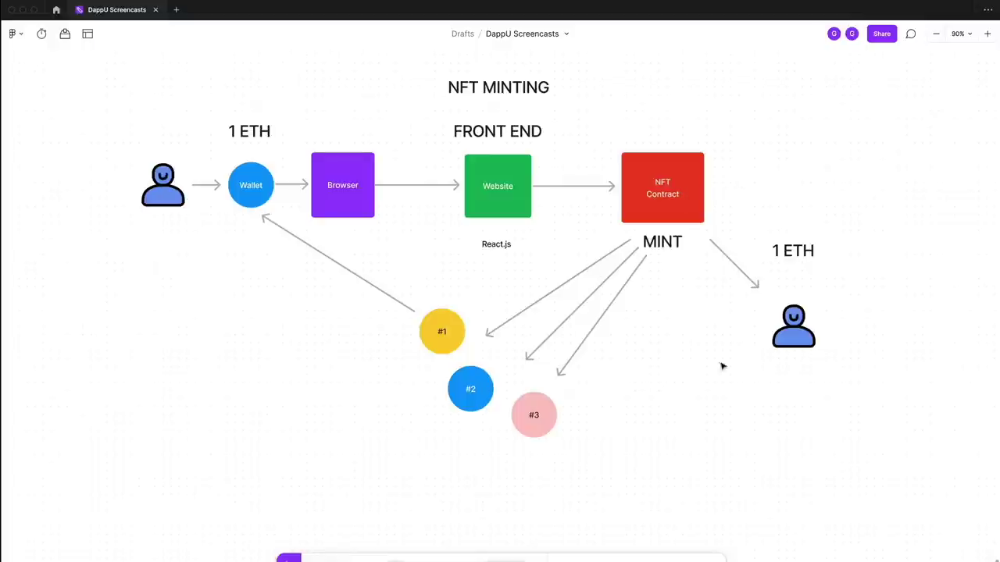
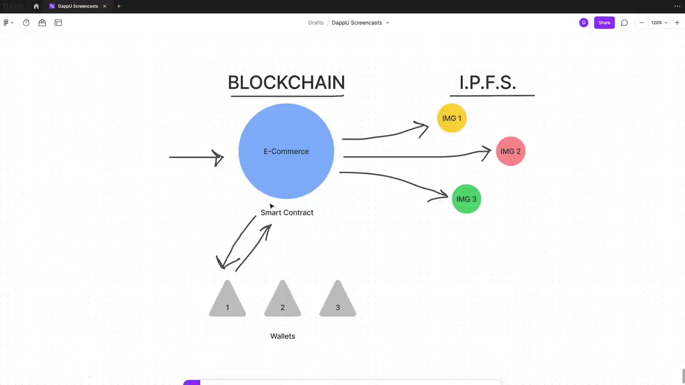

# Notes

## Intro

## IPFS

## Owner

The owner of a smart contract is the address that deploys the smart contract to the blockchain.
It can change.
The owner is who owns the smart contract and can change the state of the smart contract.

**Copilot**:

The state of a smart contract refers to the current status or condition of the contract. In the context of blockchain and cryptocurrencies, a smart contract is a self-executing contract with the terms of the agreement directly written into code.

The state includes all data stored on the contract at a given point in time. This could be information such as the balance of a cryptocurrency wallet, the ownership of a digital asset, or any other data that the contract is designed to handle.

The state can change as a result of transactions or function calls that interact with the smart contract. For example, a function in the contract might change the owner of a digital asset, which would change the state of the contract.

## Wei

Wei is the smallest denomination of ether, the cryptocurrency used on the Ethereum network. It is named after Wei Dai, a computer scientist and cryptographer known for his contributions to the development of digital currency.

## Emit Event

Emitting an event in Solidity is a way to notify the front-end application that something has happened on the blockchain. It is a way to communicate from the smart contract to the front-end application.

## block.timestamp

`block.timestamp` is a global variable in Solidity that gives the current block timestamp as a Unix timestamp (seconds since the Unix epoch).
